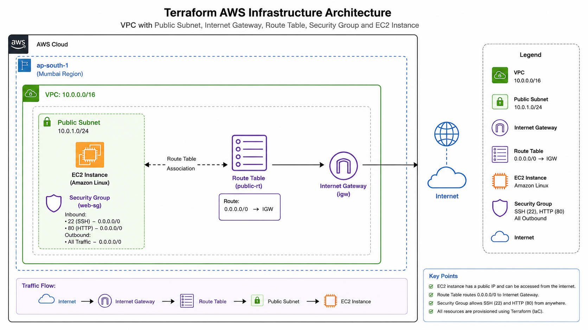
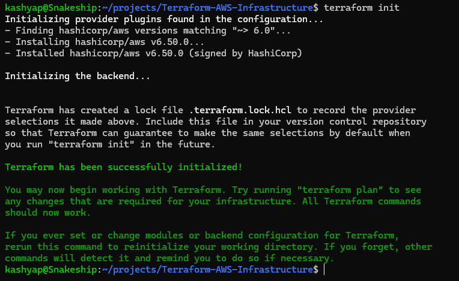
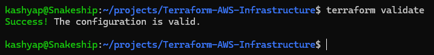
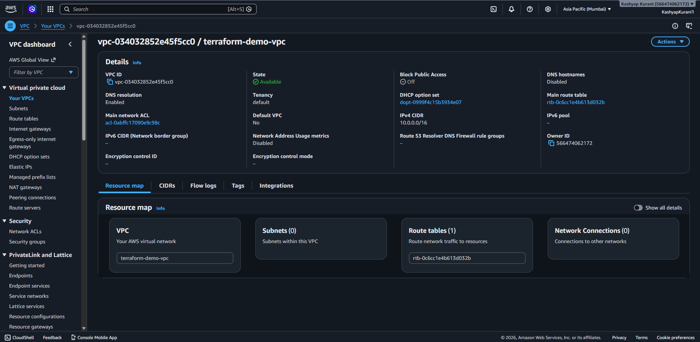
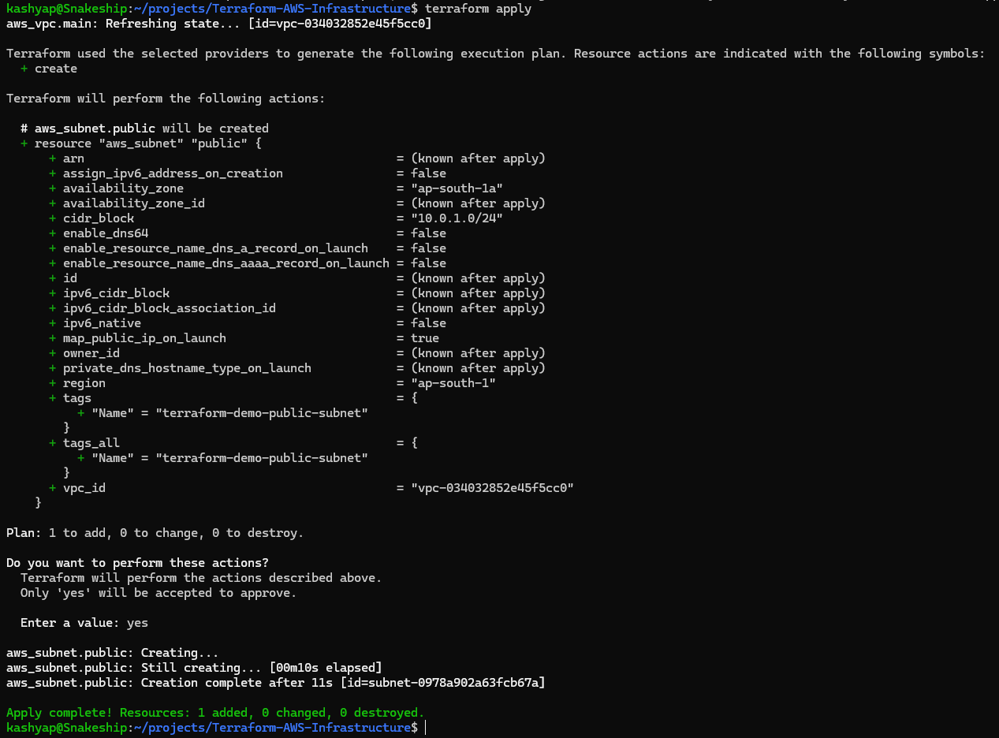
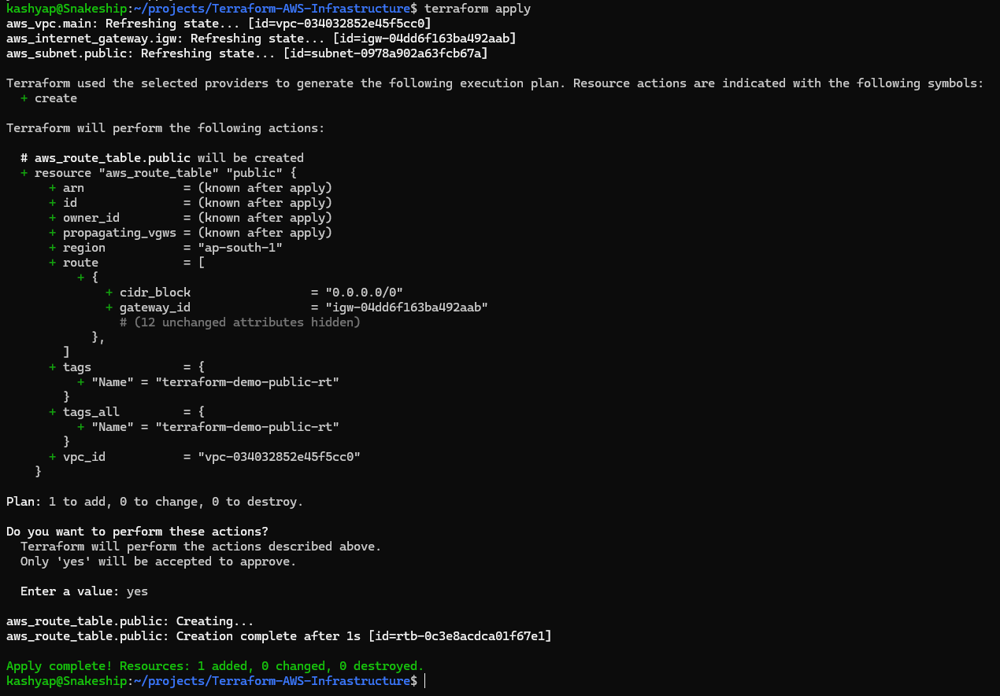
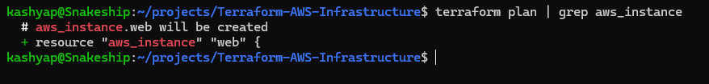
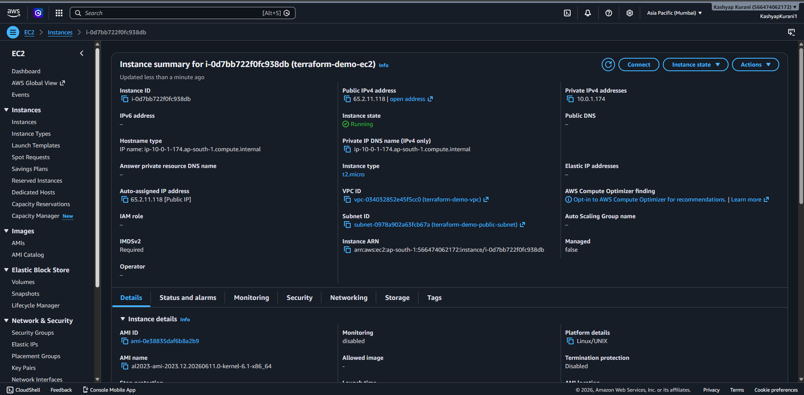

# Terraform AWS Infrastructure

## Project Overview

This project demonstrates Infrastructure as Code (IaC) using Terraform to provision AWS networking resources and an EC2 instance.

The infrastructure includes:

* VPC
* Public Subnet
* Internet Gateway
* Route Table
* Route Table Association
* Security Group
* EC2 Instance

---

### Architecture




### Architecture Flow

```text
Internet
   │
Internet Gateway
   │
Route Table
   │
Public Subnet
   │
EC2 Instance
```

---

## Technologies Used

* Terraform
* AWS EC2
* AWS VPC
* AWS Subnets
* AWS Internet Gateway
* AWS Route Tables
* AWS Security Groups
* AWS CLI
* Git & GitHub

---

## Infrastructure Created

| Resource         | Purpose                       |
| ---------------- | ----------------------------- |
| VPC              | Isolated AWS network          |
| Public Subnet    | Hosts public resources        |
| Internet Gateway | Enables internet connectivity |
| Route Table      | Controls traffic routing      |
| Security Group   | Firewall rules                |
| EC2 Instance     | Compute resource              |

---

## Project Structure

```text
Terraform-AWS-Infrastructure/
├── .gitignore
├── README.md
├── main.tf
├── outputs.tf
├── provider.tf
├── terraform.tfvars
├── variables.tf
├── screenshots/
├── provider.tf
├── variables.tf
├── outputs.tf
└── main.tf
```

---

## Prerequisites

Install:

* AWS CLI
* Terraform
* Git

Verify installation:

```bash
aws --version
terraform version
git --version
```

Verify AWS credentials:

```bash
aws sts get-caller-identity
```

---

## Deployment Steps

### Initialize Terraform

```bash
terraform init
```

### Validate Configuration

```bash
terraform validate
```

### Format Code

```bash
terraform fmt
```

### Review Execution Plan

```bash
terraform plan
```

### Create Infrastructure

```bash
terraform apply
```

Type:

```text
yes
```

### View Terraform State

```bash
terraform state list
```

### View Outputs

```bash
terraform output
```

---

## Screenshots

### Terraform Initialization



### Terraform Validation



### VPC Created



### Subnet Created



### Route Table Created



### EC2 Creation Plan



### EC2 Created



---

## Terraform Commands Used

```bash
terraform init
terraform validate
terraform fmt
terraform plan
terraform apply
terraform output
terraform state list
terraform destroy
```

---

## Learning Outcomes

Through this project I learned:

* Infrastructure as Code (IaC)
* Terraform resource management
* AWS networking fundamentals
* VPC and subnet configuration
* Internet Gateway and routing
* Security Group management
* EC2 provisioning using Terraform
* Terraform state management

---

## Cleanup

To avoid AWS charges, destroy all resources after testing:

```bash
terraform destroy
```

---

## Future Improvements

* Remote Backend (S3)
* DynamoDB State Locking
* User Data Scripts
* Nginx Installation Automation
* Load Balancer
* Auto Scaling Group
* GitHub Actions Integration

---

## Author

**Kashyap Kurani**

DevOps | Cloud Engineering | AWS | Terraform | Docker | CI/CD
